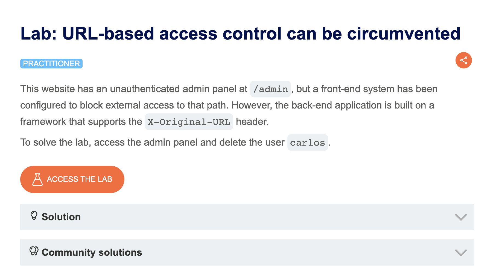
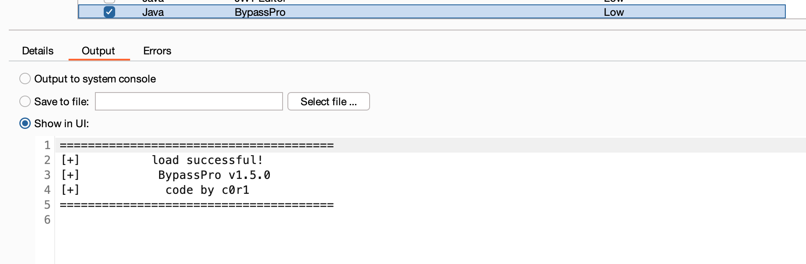
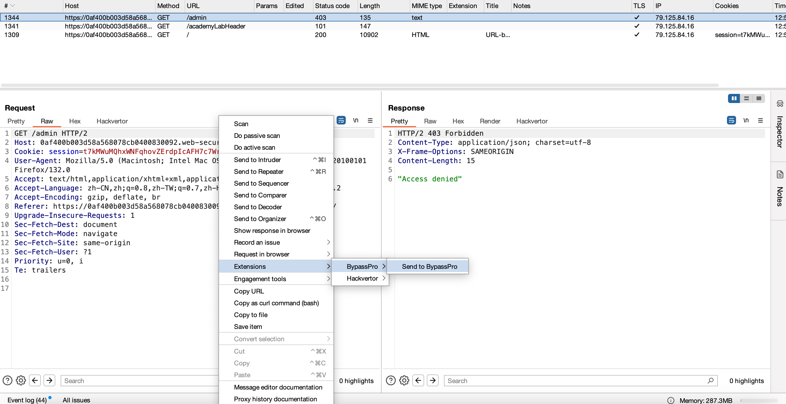
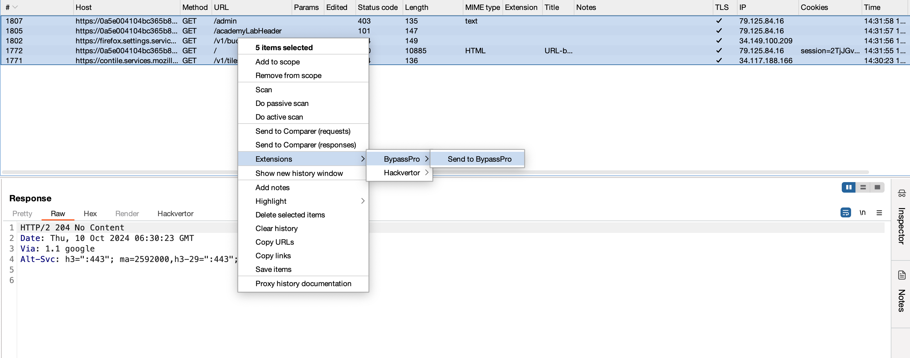
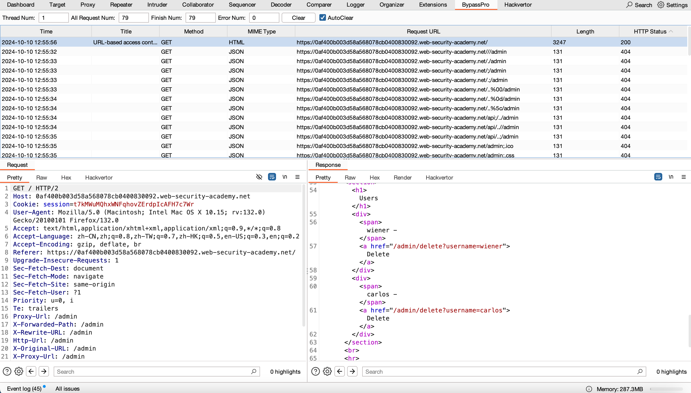
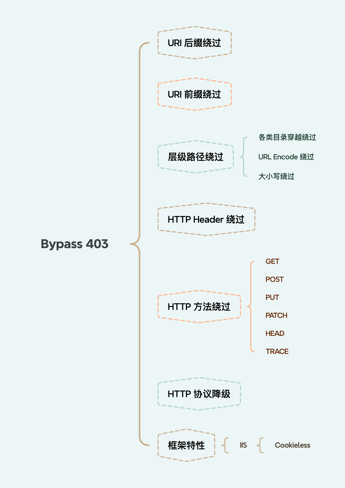
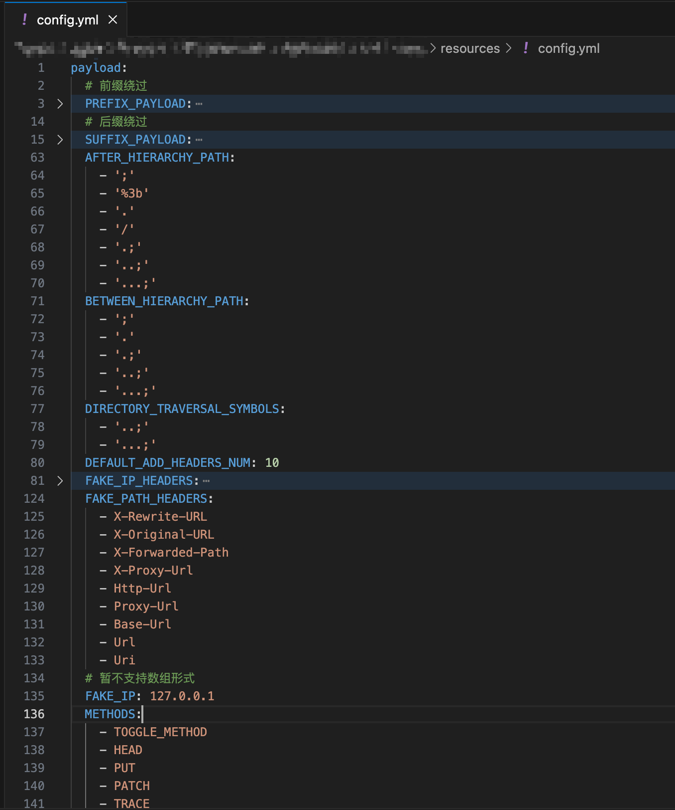

# BypassPro

一个自动化 bypass 403/auth 的 Burpsuite 插件，重构自：[AutoBypass403-BurpSuite](https://github.com/p0desta/AutoBypass403-BurpSuite)

申明：该工具只用于安全自测，禁止用于非法用途

## Note

- **插件采用 Montoya API 进行开发，使用插件需要升级你的 BurpSuite 版本（>=2024.7）**

## Changelog

- v1.5.1 - 2024-10-12
    - 配置文件实时加载
    - 添加基于指定前缀路径的 Fuzz

      假设配置如下：

      ```
      # 允许访问的路径
      ALLOWED_ACCESS_PATHS:
        - '/api/'
        - '/static/'
        - '/static/js/'
        - '/static/js/aaa.js'
      # 待添加的目录穿越符号
      DIRECTORY_TRAVERSAL_SYMBOLS:
        - '..'
        - '...'
        - '..;'
        - '...;'
      ```

      针对路径 `/a1/b2/c3` 进行 Fuzz 时，会访问如下路径：

      ```
      /api/../a1/b2/c3
      /api/.../a1/b2/c3
      /api/..;/a1/b2/c3
      /api/...;/a1/b2/c3
      /static/../a1/b2/c3
      /static/.../a1/b2/c3
      /static/..;/a1/b2/c3
      /static/...;/a1/b2/c3
      /static/js/../../a1/b2/c3
      /static/js/.../.../a1/b2/c3
      /static/js/..;/..;/a1/b2/c3
      /static/js/...;/...;/a1/b2/c3
      /static/js/aaa.js/../../../a1/b2/c3
      /static/js/aaa.js/.../.../.../a1/b2/c3
      /static/js/aaa.js/..;/..;/..;/a1/b2/c3
      /static/js/aaa.js/...;/...;/...;/a1/b2/c3
      ```

- v1.5.0 - 2024-10-10
    - Init

## How to Run

以 PortSwigger Lab
为例：https://portswigger.net/web-security/access-control/lab-url-based-access-control-can-be-circumvented



1. 解压缩后在 Burp Extensions 中加载 BypassPro.jar



2. 选择目标请求，右键点击 "Send to BypassPro”



支持多目标请求扫描：



3. 选择 BypassPro 标签页，查看结果

   支持响应内容相似度匹配(from @pmiaowu HostCollision); 如果返回结果相似度很高，则不展示



## Fuzz Rules



## Custom rules

修改 BypassPro.jar 所在目录下 resources/config.yml 内容，可添加自定义扫描规则

~~**PS：修改配置文件后，需要重载 BypassPro 插件，才能使新配置生效**~~



## Thanks

- https://github.com/p0desta/AutoBypass403-BurpSuite
- https://github.com/pmiaowu/BurpShiroPassiveScan
